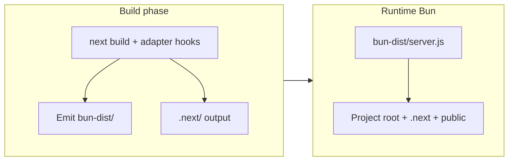

# Migrate production to Next.js adapter-bun (3dmodels)

## Context

- **This repo**: Single app at the workspace root (`src/app`, `next.config.ts`, `package.json`). Scripts already use Bun for dev/build/start (`bun --bun run next dev|build|start`). **`vercel.json`** sets `bunVersion: "1.x"` and `buildCommand: "bun --bun run next build"`.
- **No Docker**: Do not add or assume Dockerfile / Compose; validation is **local Bun** (and whatever you configure on Vercel or another host).
- **adapter-bun** produces a **`bun-dist/`** tree and a Bun-oriented server entry instead of relying on `next start` alone (see [adapter-bun README](https://github.com/nextjs/adapter-bun)).
- The upstream package may still be **`"private": true` on npm** or only distributed via Git—use a **pinned Git dependency** (commit SHA) if there is no semver release you trust.

## 1. Add the dependency (pinned Git ref)

- In root [`package.json`](package.json), add `adapter-bun`, e.g. `"adapter-bun": "github:nextjs/adapter-bun#<commit-sha>"` (pick a known-good SHA after a successful build).
- Run `bun install` so any `prepare` / build steps for the dependency complete and `dist/` exists where expected.

## 2. Adapter entry module

- Add [`bun-adapter.ts`](bun-adapter.ts) at the **project root** (same level as `next.config.ts`), exporting the adapter with `createBunAdapter` per the README:
  - **`deploymentHost`**: from env (e.g. `BUN_ADAPTER_DEPLOYMENT_HOST` or your public URL) so **Server Actions** CSRF allow-listing matches production.
  - **`hostname` / `port`**: bind appropriately (e.g. `0.0.0.0`, read `PORT` from the environment for PaaS).
  - **`cacheHandlerMode`**: start with README defaults (`http` vs `sqlite`); if you later run **multiple replicas**, plan shared cache behavior (HTTP + shared secret or external cache).

## 3. Register `adapterPath` in Next config

- Update [`next.config.ts`](next.config.ts) to set **`adapterPath`** to the resolved adapter entry using the README pattern: `createRequire(import.meta.url)` + `require.resolve("./bun-adapter.ts")` (compatible with `"type": "module"`).
- Preserve unrelated options: `cacheComponents`, `images`, `experimental`, `reactCompiler`, etc. Run a full **`bun --bun run next build`** and fix any adapter-specific issues.

## 4. Scripts and local verification

- Update root [`package.json`](package.json) **`start`** (and optionally add **`start:bun-adapter`**) to run the adapter server, e.g. `bun bun-dist/server.js` (default `outDir`), instead of `bun --bun run next start` when you want the adapter path in production-like runs.
- Document for yourself: runtime env vars from the README (`PORT`, `NEXT_PROJECT_DIR` if cwd differs, `BUN_ADAPTER_*` as needed).
- **Smoke test**: `bun --bun run next build`, then `bun bun-dist/server.js`, exercise auth (Better Auth), any Server Actions, and cache invalidation flows you rely on.

## 5. Monorepo / Turbo

- **Not applicable**: This project has no `turbo.json`. If you add Turborepo later, include **`bun-dist/**`** in the web package’s build outputs so caches do not omit the adapter artifact.

## 6. Vercel (this project)

- [`vercel.json`](vercel.json) already pins **Bun** for the build. The platform’s **default Next.js runtime** after build may still differ from “run `bun bun-dist/server.js` locally” depending on Vercel’s current support for custom Next adapters and Bun as the **production server**.
- **Action items** (read current Vercel + Next docs; do not assume the old monorepo plan’s Docker-vs-Vercel wording):
  - Confirm whether production should use the **adapter server** on Vercel or remain on Vercel’s managed Next handler.
  - If Vercel cannot run the adapter entry the way you need, treat **adapter-bun** as the path for **self-hosted Bun** and keep Vercel as previews or a separate build target.

## 7. Risk / validation checklist

- **Git dependency**: pin SHA; bump intentionally when upgrading adapter-bun.
- **Working directory**: ensure the process cwd finds `.next` and `public` (use `NEXT_PROJECT_DIR` if you run from another folder).
- **Feature parity**: exercise flows that depend on ISR, `revalidateTag` / `revalidatePath`, `next/image`, and middleware/proxy per the adapter README.
- **sharp**: adapter may depend on `sharp`; ensure Bun/OS compatibility in your environment (local and host).
